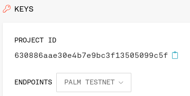

# Connect to Palm Testnet

To connect to Palm Testnet:

1. Create an [Infura](https://infura.io/) account and set up an Ethereum project

    If you don't already have an Ethereum account, you can use [MetaMask](https://metamask.io/) to create one.

    !!! note

        You can follow [this step-by-step guide](https://blog.infura.io/getting-started-with-infura-28e41844cc89/) for
        creating an Infura account and your first Ethereum project.

3. Locate your Ethereum `project ID` on Infura

    Go to the project you created in Step 1, and click on the "Settings" tab.
  The project ID is located in the "Keys" box on this page.

    

4. Create your access URL

    * First method: using INFURA's endpoints list:

    

    * Second method: Using the following template (replacing `<YOUR-PROJECT-ID>` with the project ID):

    ```url
    https://palm-testnet.infura.io/v3/<YOUR-PROJECT-ID>
      ```

5. Confirm that the access works using the following command (replacing `<ACCESS-URL>` with the access URL):

    === "curl HTTP request"

        ```bash
        curl <ACCESS-URL> -X POST -H "Content-Type: application/json" -d '{"jsonrpc":"2.0","method":"eth_accounts","params":[],"id":1}'
        ```

    === "JSON result"

        ```json
        {"jsonrpc":"2.0","id":1,"result":[]}
        ```

    You can view the [Infura JSON-RPC API](https://infura.io/docs/ethereum#tag/JSON-RPC-Methods) and
    [how to make requests](https://infura.io/docs/ethereum#section/Make-Requests) in the
    [Infura documentation](https://infura.io/docs/ethereum).

    If you need further assistance with this, you can obtain support from the INFURA team by filling out 
    [the INFURA support request](https://infura.io/support/ticket) for help and to make sure you've
    completed these steps successfully.
    After connecting to and interacting with Palm Testnet, you can view [the Palm Testnet block explorer](https://explorer.palm-uat.xyz/).

6. Now, you will need PALM to send transactions on Palm Network

[Top up your account with PALM](../Tokens.md)


!!! question
    Any question? Drop them on our [Discord](https://discord.gg/grcpwNRxVj)
