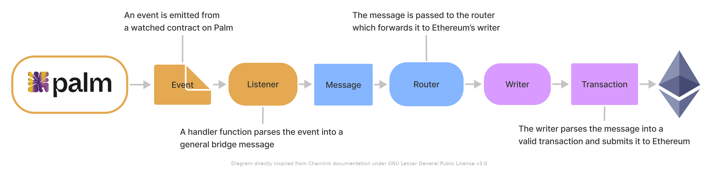

# Palm Bridge Overview

The article needs to give:
* A high-level view of Palm’s cross-chain bridge
  *Problem: Why it’s needed
  *Solution: what it solves
  *Implementation: how it solves the problem
* A lower-level explanation of Palm’s solution
What solution it leverages
How it’s set up (with diagram)

<!-- This article is a high-level description of the Palm bridge, if you are already familiar with it and wish to learn how to use it for your own NFT contracts, please refer to  -->

The Palm network enables NFT trading in a fast, cost-efficient and eco-friendly manner. However, some use-cases can require moving assets from Palm to Ethereum mainnet in order to reach marketplaces such as [OpenSea](https://opensea.io/).

To address that use-case, the Palm bridge enables the transfer of tokens from Palm to Ethereum and back. What follows is a high-level description of how the bridge enables these operations and how to integrate your contracts with the bridge.

## What Does The Palm Bridge Do?

The bridge allows to transfer assets such as ERC-20 and ERC-721 tokens back and forth between the Palm network and Ethereum mainnet.

In the case of NFTs, the bridge works by locking tokens that have already been minted on one side of the bridge, and then minting an equivalent token on the other side, using what we call a “synthetic” version of the ERC-721 contract.

Users can send their tokens back to the original side, and the bridge will burn the synthetic token, and unlock the original token that will be transferred to the destination wallet address.

Moving assets from Palm to Ethereum requires a small fee (to cover gas and carbon offsets) while moving assets back to Palm tops up the depositor's account with a small amount of PALM.

Now let's dive a bit deeper into how the bridge operate:

## How Does The Palm Bridge Work?
Diagram directly inspired from Chainlink documentation under GNU Lesser General Public License v3.0
The Palm bridge runs on [ChainBridge](https://chainbridge.chainsafe.io/), a communication protocol where events on the source chain are used to send messages routed to the destination chain where they will be submitted as transactions.

ChainBridge uses three components:

 - **Relayers** — Off-chain servers that listen for particular events on the source chain and- when certain conditions are met- submit signed proposals to the destination chain.
 - **Bridge contracts** — Delegate calls to the handler contracts for deposits, start a transaction on the source chain, and for executions of the proposals on the target chain
 - **Handler contract** — Palm's handler contract sends mint/burn transactions depending on the user input
 - **Target contract** — On Palm, target contracts are ERC-721 contracts on each side of the bridge

<!-- ### General Workflow {: #general-workflow }  -->

<!-- The general workflow is the following (from Chain A to Chain B): -->

<!--   - A user initiates a transaction with the _deposit()_ function in the bridge contract of Chain A. Here, the user needs to input the target chain, the resource ID, and the _calldata_ (definitions after the diagram). After a few checks, the _deposit()_  function of the handler contract is called, which executes the corresponding call of the target contract. -->
<!--   - After the function of the target contract in Chain A is executed, a _Deposit_ event is emitted by the bridge contract, which holds the necessary data to be executed on Chain B. This is called a proposal. Each proposal can have five status (inactive, active, passed, executed and cancelled).  -->
<!--   - Relayers are always listening on both sides of the chain.  Once a relayer picks up the event, he initiates a voting on the proposal, which happens on the bridge contract on Chain B. This sets the state of the proposal from inactive to active. -->
<!--   - Relayers must vote on the proposal. Every time a relayer votes, an event is emitted by the bridge contract that updates its status. Once a threshold is met, the status changes from active to passed. A relayer then executes the proposal on Chain B via the bridge contract. -->
<!--   - After a few checks, the bridge executes the proposal in the target contract via the handler contract on Chain B. Another event is emitted, which updates the proposal status from passed to executed. -->

<!-- This workflow is summarized in the following diagram: -->

<!--  -->

<!-- The two target contracts on each side of the bridge are linked by doing a series of registrations in the corresponding handler contract via the bridge contract. These registrations currently can only be done by the bridge contract admin. -->

<!-- ### General Definitions {: #general-definitions }  -->

<!-- Here we have put together a list of concepts applicable to the ChainBridge implementation (from Chain A to Chain B): -->

<!--  - **ChainBridge Chain ID** — this is not to be confused with the chain ID of the network. It is a unique network identifier used by the protocol for each chain. It can be different from the actual chain ID of the network itself. For example, for Moonbase Alpha and Rinkeby, we've set the ChainBridge chain ID to 43 and 4 respectively (Kovan was set to 42) -->
<!--  - **Resource ID** — is a 32 bytes word that is intended to uniquely identify an asset in a cross-chain environment. Note that the least significant byte is reserved for the chainId, so we would have 31 bytes in total to represent an asset of a chain in our bridge. For example, this may express tokenX on Chain A is equivalent to tokenY on Chain B -->
<!--  - **Calldata** — is the parameter required for the handler that includes the information necessary to execute the proposal on Chain B. The exact serialization is defined for each handler. You can find more information [here](https://chainbridge.chainsafe.io/chains/ethereum/#erc20-erc721-handlers) -->
