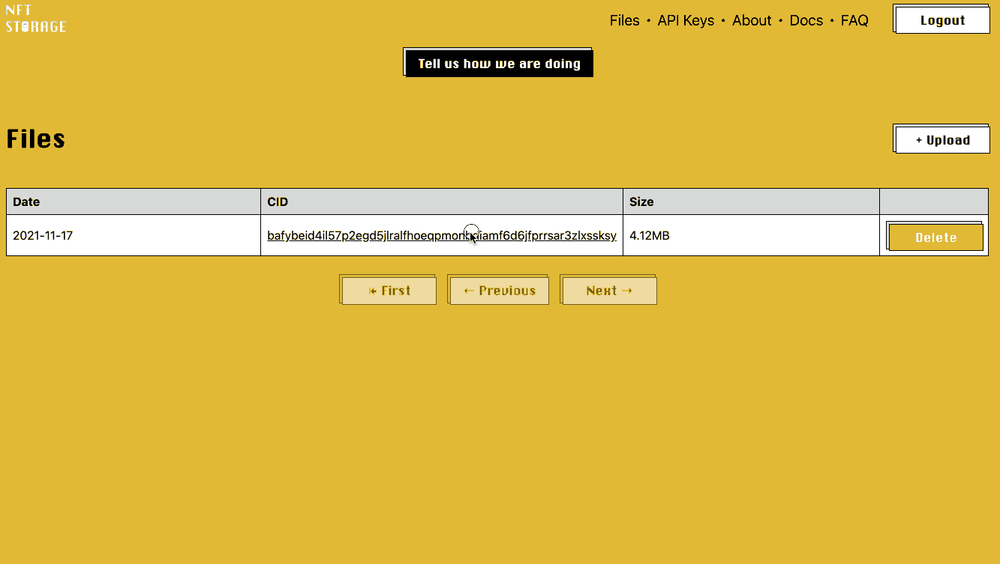

# How to mint an NFT on Palm using Hardhat

This guide walks you through minting an NFT on the Palm network using [Hardhat](https://hardhat.org/)

!!! important

    This article is a follow-up to: ["Deploy an NFT contract using Hardhat"](./Deploy-using-Hardhat.md). You'll probably want to [read this first](./Deploy-using-Hardhat.md) before applying the below.

  The previous article in this series: ["Deploy an NFT contract using Hardhat"](./Deploy-using-Hardhat.md), describes how to deploy an `ERC-721` smart contract on the Palm network. The below goes further and proposes one way to publish an `ERC-721` token on Palm network, or, in simpler terms, minting an NFT.

## Prerequisite

- Reading and applying: ["Deploy an NFT contract using Hardhat".](./Deploy-using-Hardhat.md)


### What our code will do

!!! note

    The complete source code explained in this article is [available for download.](https://github.com/Palm-Network/training-deploy-mint-nft-hardhat)

  We are about to write the code logic that triggers a 'minting' transaction. Let's take a quick look at what minting means in the context of the [contract](./Deploy-using-Hardhat.md#5.-Write-your-contract) we deployed:


  ```js
      function mintNFT(address recipient, string memory tokenURI)
          public
          returns (uint256)
      {
          _tokenIds.increment();

          uint256 newItemId = _tokenIds.current();
          _safeMint(recipient, newItemId);
          _setTokenURI(newItemId, tokenURI);

          return newItemId;
      }
  }
  ```

  This is what our solidity code's `mintNFT` function does:

* `_tokenIds.increment();`: '_tokenIds' inherits from [Open Zeppelin's counter functions](https://docs.openzeppelin.com/contracts/4.x/api/utils#Counters),'increment()'. It will increase a counter by 1, thus enabling our code to generate a unique Token ID,

* `uint256 newItemId = _tokenIds.current();`: assigns the current count number to a new instance of _'tokenIds' named 'newItemId'

* `_safeMint(recipient, newItemId);`: mints 'newItemId' and assigns it to 'recipient' (an address).

* `_setTokenURI(newItemId, tokenURI);`: sets 'tokenURI' as the URI of our NFT's metadata file, we'll explain what an NFT's metadata file is later in this article.

In short, the above code will send a transaction that will transfer a unique NFT instance to a particular Ethereum address.

  The following explains how to write a script that calls the minting function in the contract we deployed [earlier](./Deploy-using-Hardhat.md):

## Steps

1. Create a `mint.js` file:

    Inside your scripts directory, create a `mint.js` file.

    We will use the [Hardhat-flavored version](https://hardhat.org/plugins/nomiclabs-hardhat-ethers.html) of the [`ethers.js`](https://docs.ethers.io/v5/) library, which provides more abstractions than [`web3.js`](https://web3js.readthedocs.io/en/v1.5.2/), resulting in leaner code.

    Let's start by requiring the correct libraries:

    ```js
    require("dotenv").config();
    require("@nomiclabs/hardhat-ethers");
    ```

2. Create a variable representing your contract's `ABI`:

    Our contract's [ABI (Application Binary Interface)](https://docs.soliditylang.org/en/latest/abi-spec.html) is the interface enabling our js script to interact with our smart contract. Hardhat generates and stores the ABI version of our contract in the `artifacts` folder as a JSON file.

    Add the following to `mint.js`:

    ```js
    const contract = require("../artifacts/contracts/NFT.sol/NFT.json");
    const contractInterface = contract.abi;
    ```

3. Add a provider:

    In `Ethers.js` parlance, a provider represents a connection to an Ethereum blockchain. We'll add one to enable your app to interact with the Palm network. In this scenario, because we're using the [Hardhat plugin version of Ethers.js](https://hardhat.org/plugins/nomiclabs-hardhat-ethers.html), our `ethers.provider` object retrieves all the connection details from `hardhat.config.js`.

    Add this line to `mint.js`:

    ```js
    let provider = ethers.provider;
    ```

4. Upload a media file to IPFS:

    This step consists of adding a media file of your choice to [IPFS](https://ipfs.io/), the decentralized storage system. In order to help ensure this file's availability, you can "pin" the file in IPFS. There are several pinning services available that will maintain your file on IPFS. Here are a few to consider:

    * [INFURA](https://infura.io/)
    * [Ethernum](https://www.eternum.io/)
    * [Pinata](https://www.pinata.cloud/)
    * [NFT Storage](https://nft.storage/)

    Here we'll use [NFT Storage](https://nft.storage/).
    Simply log into [NFT Storage's](https://nft.storage/) website, upload your file and save its `URI`, you'll need it in the next step:


    

5. Create your NFT's Metadata file:

    An NFT Metadata file serves as a descriptor for the media file your NFT represents. It enables you to specify the NFT's name, `URI`, and other attributes. The Metadata file is a `JSON` document, and in this article, we'll implement the [ERC721 Metadata JSON Schema](https://github.com/ethereum/EIPs/blob/master/EIPS/eip-721.md).

    In the root directory, create a new file called `nft-metadata.json`, edit the following `JSON` code to match your NFT's specifications. Now would be the time to add the `URI` of the image you saved in step 4.

    ```json
    {
        description: "pfp",
        image: "URI-of-profile-picture",
        name: "pfp #123",
        attributes: [
            {
                trait_type: "Background",
                value: "White"
            },
            {
                trait_type: "Hair Style",
                value: "Long Straight Bangs"
            },
            {
                trait_type: "Hair Color",
                value: "Black"
            },
            {
                trait_type: "Accessories",
                value: ""
            }
        ]
    }
    ```

    Upload `nft-metadata.json` to [NFT Storage](https://nft.storage/), then copy its `URI` and add it to the `tokenURI` variable.


    ```js
    const tokenURI = "<`URI` of your metadata file>";
    ```

    The variable we just declared,`tokenURI` will be passed as an argument to the contract's `mintNFT` function.

6. Update your `.env` file:

    Add your public key to a `PUBLIC_KEY` variable in your `.env` file:

    `PUBLIC_KEY = "your-account-address"`

    Get the address of the [contract you deployed earlier](./Deploy-using-Hardhat.md)  (it is the address returned by Hardhat upon deployment) and create a `.env` variable pointing to that address:

        ```bash
        `CONTRACT_ADDRESS = "deployed-contract-address"`
        ```
    If you followed the instructions in the previous article, your `.env` file should now contain the following variables:

    ```
    API_URL = "your-provider-api-url"
    PRIVATE_KEY = "your-private-account-address"
    PUBLIC_KEY = "your-public-account-address"
    CONTRACT_ADDRESS = "deployed-contract-address"
    ```

7. Set up `Ethers.js` signer and wallet

    The wallet is a convenient class in `Ethers.js`, it represents an Ethereum account and enables one to sign transactions and messages like an [EOA](https://ethereum.org/en/developers/docs/accounts/) would.

    Add the following to `mint.js`:

    ```js
    const privateKey = `0x${process.env.PRIVATE_KEY}`;
    const wallet = new ethers.Wallet(privateKey);
    wallet.provider = provider;
    const signer = wallet.connect(provider);
    ```

8. Set up `Ethers.js` contract

    An `Ethers.js` contract is a representation of the actual contract that has been deployed. This class enables you to interact with your contract using javascript. You can send it a transaction; in this case, we will use it to trigger our `MintNFT` function.


    Add these lines of code to `mint.js`:

    ```js
    const nft = new ethers.Contract(
      process.env.CONTRACT_ADDRESS,
      contractInterface,
      signer
    );
    ```

9. Build the `main` function

    Finally, create the `main` function, which will asynchronously call the `MintNFT` function passing as arguments:

    * Your address (or any other recipient address you chose)

    * The `URI` of your NFT's metadata

    Your `mint.js` file should now look like this:

    ```js
    require("dotenv").config();
    require("@nomiclabs/hardhat-ethers");
    const contract = require("../artifacts/contracts/NFT.sol/NFT.json");
    const contractInterface = contract.abi;

    // https://hardhat.org/plugins/nomiclabs-hardhat-ethers.html#provider-object
    let provider = ethers.provider;

    const tokenURI = "https://bafkreifvtwuiypleu4vv7edh4zclmymp5ixh44xxmd3hb2imiqa7mp2c3a.ipfs.dweb.link/";
    const privateKey = `0x${process.env.PRIVATE_KEY}`;
    const wallet = new ethers.Wallet(privateKey);

    wallet.provider = provider;
    const signer = wallet.connect(provider);

    // https://docs.ethers.io/v5/api/contract/contract
    const nft = new ethers.Contract(
      process.env.CONTRACT_ADDRESS,
      contractInterface,
      signer
    );

    const main = () => {
      console.log("Waiting 5 blocks for confirmation...");
      nft
        .mintNFT(process.env.PUBLIC_KEY, tokenURI)
        .then((tx) => tx.wait(5))
        .then((receipt) => console.log(`Your transaction is confirmed, its receipt is: ${receipt.transactionHash}`))

        .catch((e) => console.log("something went wrong", e));
    };

    main();
    ```

9. Call `mint.js`


    Now, all you need to do is run `mint.js` to deploy your NFT:


    === "Mint on Palm Testnet"

        ```bash
        npx hardhat run scripts/mint.js --network palm_testnet
        ```

    === "Mint on Palm Mainnet"

        ```bash
        npx hardhat run scripts/mint.js --network palm_mainnet
        ```

    We required the confirmation to be 5 blocks, as you can see in your code in the `main` function: `tx.wait(5))`, it'll therefore take a few seconds before seeing the following response in your terminal:

    `Your transaction is confirmed, its receipt is: `0x10e5062309de0cd0be7edc92e8dbab191aa2791111c44274483fa766039e0e00``

    You can now look up your minted token on the Palm network block explorer by pasting the receipt hash above in the search bar:

    === "For NFTs minted on Palm Testnet"

        Go to https://explorer.palm-uat.xyz

    === "For NFTs minted on Palm Mainnet"

        Go to https://explorer.palm-uat.xyz

    Your NFT is minted. Note that your deployed contract can act as an NFT factory, enabling you to mint any number of tokens.

    If you want to see your token appear in your MetaMask wallet, go to MetaMask, choose "Import token", paste the address of the contract that you used to mint your NFT, and add a name and zero as decimal.

!!! question
    Any question? Drop them on our [Discord](https://discord.gg/grcpwNRxVj)
