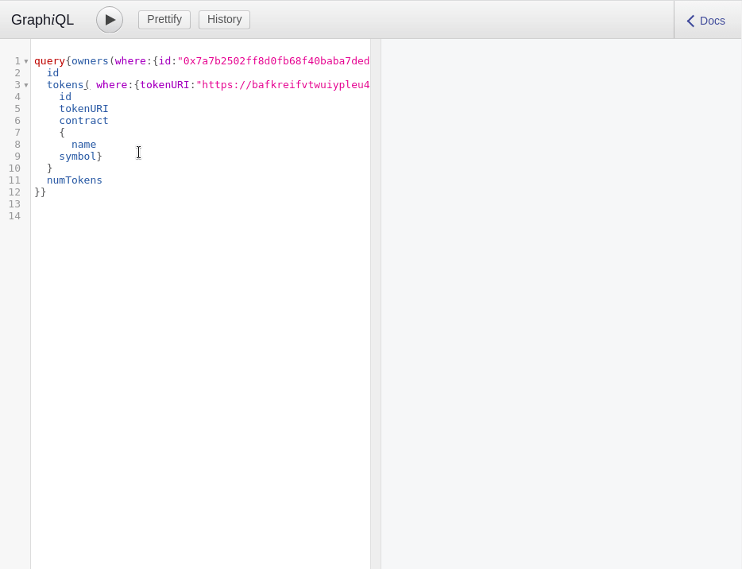
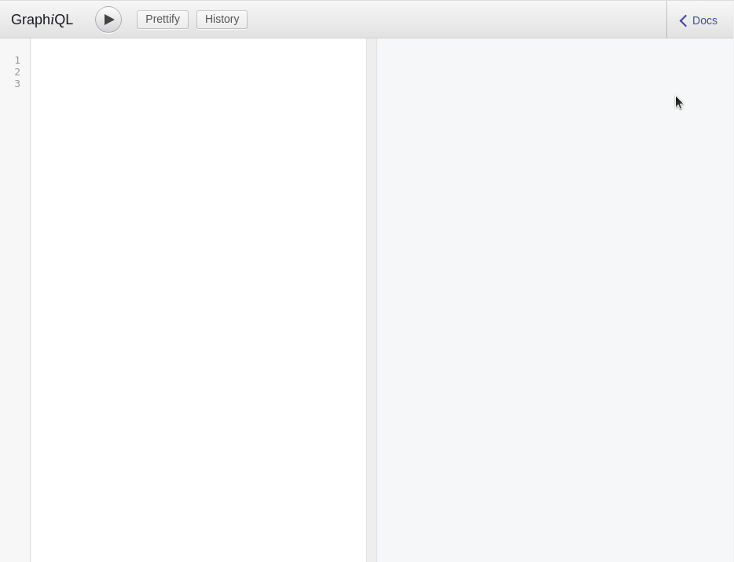

# Using The Graph on the Palm network

Dapps such as NFT markets constantly need to retrieve on-chain data pertaining to token transfers or asset minting.
One way to obtain that information is to pull it directly from the blockchain, but it’s a complicated process which often requires building an ad-hoc server instance.
A more efficient path is to use dedicated protocols like [The Graph](https://thegraph.com/en/), which focus on smart contract data indexation and storage.

This guide aims at helping you use The Graph by explaining:

1. [How The Graph works](#1-how-does-the-graph-work)

2. [How to query the Palm network’s Subgraphs](#2-querying-the-palm-networks-subgraphs)

3. [What Subgraphs are available on the Palm network](#3-deployed-subgraphs-on-the-palm-network)

4. [How to use Subgraphs from a Dapp](#4-using-the-graph-from-a-dapp)

5. [How to build your own Subgraph](#5-how-to-build-a-new-subgraph)

6. [to add your own Subgraph to the Palm network](#6-how-to-add-your-own-subgraph-to-the-palm-network)

## 1. How does The Graph work?
The Graph is a decentralized protocol for querying blockchains like the Palm network. It enables developers to build custom APIs called Subgraphs.

Subgraphs listen to specific smart contract events and act as data stores so that the information can be easily retrieved by a Dapp. Since Subgraphs are built around developers’ specific data requirements (e.g. [IEP-721 subgraph schema](https://github.com/wighawag/eip721-subgraph/blob/master/schema.graphql) ) they only need to be called once, unlike general-purpose APIs which sometimes require hundreds of calls to gather relevant information.

You can learn more about The Graph network and protocol [on their site](https://thegraph.com/en/).

## 2. Querying the Palm network’s Subgraphs

The Graph is an implementation of [GraphQL](https://graphql.org/learn/), If you are familiar with graphql, you should be comfortable querying The Graph, just make sure to learn the specifics of [The Graph’s API](https://thegraph.com/docs/en/developer/graphql-api/).

If you haven’t used GraphQL before, https://graphql.org and [howtographql.com](https://www.howtographql.com/) can be good places to start.

To start experimenting with Subgraphs and graphql, developers can use:

* A [training toolkit](https://github.com/Palm-Network/training-toolkit/blob/main/contracts/NFT.sol) to deploy a contract and mint some NFTs on the Palm Network right-away

* [GraphiQL](https://github.com/graphql/graphiql) To test queries against deployed Subgraphs and the NFTs you’ve just minted

**Note**: These tools are entirely optional.

The training-toolkit enables you to deploy a [simplified EIP-721 NFT smart contract](https://github.com/Palm-Network/training-toolkit/blob/main/contracts/NFT.sol) and mint random items right away to test your subgraph queries against items you control:

**Steps:**

If this is your first time interacting with the Palm network, please refer to the [connect with testnet](../../Get-Started/Connect/Testnet.md) or [mainnet](../../Get-Started/Connect/Mainnet.md) articles. Once you are granted access to the network:

1. **Clone the repo**

``` bash
  git clone git@github.com:Palm-Network/training-toolkit.git
```

2. **Install**

``` bash
  npm install
```

3. **Add a .env file and add values to the following variables:**

```
INFURA_PROJECT_ID
PRIVATE_KEY
PUBLIC_KEY
```
4. **Deploy contract to Palm Testnet:**

``` bash
  npx hardhat run scripts/deploy.js --network palm_testnet
```

5. **Add the newly deployed contract address to the .env variables:**

```
CONTRACT_ADDRESS
```
6. **Bulk Mint NFT on Palm testnet, this will mint 15 items to various addresses on Palm testnet:**
``` bash
  npx hardhat run scripts/bulk-mint.js --network palm_testnet
```

Now, to query data on your newly deployed ERC-721 contract [you can use GraphiQL](https://graph.palm.io/subgraphs/name/wighawag/eip721-subgraph/graphql?query=query%7Bowners(where%3A%7Bid%3A%220x4fb30f8cce1f80fc9cc45f7f626069be7549af59%22%7D)%20%7B%0A%20%20id%0A%20%20tokens%20%7B%0A%20%20%20%20id%0A%20%20%20%20contract%0A%20%20%20%20%7Bname%0A%20%20%20%20symbol%7D%0A%20%20%7D%0A%20%20numTokens%0A%7D%7D%0A):



[You can try the above on GraphiQL](https://graph.palm.io/subgraphs/name/wighawag/eip721-subgraph/graphql?query=query%7Bowners(where%3A%7Bid%3A%220x4fb30f8cce1f80fc9cc45f7f626069be7549af59%22%7D)%20%7B%0A%20%20id%0A%20%20tokens%20%7B%0A%20%20%20%20id%0A%20%20%20%20contract%0A%20%20%20%20%7Bname%0A%20%20%20%20symbol%7D%0A%20%20%7D%0A%20%20numTokens%0A%7D%7D%0A)

GraphiQL also enables you to [explore a subgraph’s schema](https://graph.palm.io/subgraphs/name/wighawag/eip721-subgraph/graphql?query=query%7Bowners(where%3A%7Bid%3A%220x4fb30f8cce1f80fc9cc45f7f626069be7549af59%22%7D)%20%7B%0A%20%20id%0A%20%20tokens%20%7B%0A%20%20%20%20id%0A%20%20%20%20contract%0A%20%20%20%20%7Bname%0A%20%20%20%20symbol%7D%0A%20%20%7D%0A%20%20numTokens%0A%7D%7D%0A)



### Example Queries
#### Querying all the tokens owned by a specific address

=== "graphql"

    ``` json linenums="1"
      query{owners(where:{id:"0x4fb30f8cce1f80fc9cc45f7f626069be7549af59"}) {
          id
          tokens {
            id
            contract
            {name
              symbol}
            tokenURI
          }
          numTokens
        }}
    ```

=== "curl"

    ``` bash linenums="1"
      curl --location --request POST "https://graph.palm.io/subgraphs/name/wighawag/eip721-subgraph" --data-raw '{"query":"{owners(where:{id:\"0x4fb30f8cce1f80fc9cc45f7f626069be7549af59\"}){id tokens{id contract {name symbol}}numTokens}}"}'
    ```
[Try this query with GraphiQl](https://graph.palm.io/subgraphs/name/wighawag/eip721-subgraph/graphql?query=query%7Bowners(where%3A%7Bid%3A%220x4fb30f8cce1f80fc9cc45f7f626069be7549af59%22%7D)%20%7B%0A%20%20id%0A%20%20tokens%20%7B%0A%20%20%20%20id%0A%20%20%20%20contract%0A%20%20%20%20%7Bname%0A%20%20%20%20symbol%7D%0A%20%20%7D%0A%20%20numTokens%0A%7D%7D%0A)

#### Querying all the tokens owned by a specific address and minted by a given contract


=== "graphql"

    ``` json linenums="1"
      query{owners(where:{id:"0x4fb30f8cce1f80fc9cc45f7f626069be7549af59"}) {
          id
          tokens(where:{contract:"0xdb28759b793fa2111ac2842f467fad6d3b78c2c0"}){
            id
            contract
            {
              name
              symbol
            }
          }
          numTokens
        }}
    ```

=== "curl"

    ``` bash linenums="1"
      curl --location --request POST "https://graph.palm.io/subgraphs/name/wighawag/eip721-subgraph" --data-raw '{"query":"{owners(where:{id:\"0x4fb30f8cce1f80fc9cc45f7f626069be7549af59\"}){id tokens(where:{contract:\"0xdb28759b793fa2111ac2842f467fad6d3b78c2c0\"}){id contract {name symbol}}numTokens}}"}'
    ```
[Try this query with GraphiQl](https://graph.palm.io/subgraphs/name/wighawag/eip721-subgraph/graphql?query=query%7Bowners(where%3A%7Bid%3A%220x4fb30f8cce1f80fc9cc45f7f626069be7549af59%22%7D)%20%7B%0A%20%20id%0A%20%20tokens(where%3A%7Bcontract%3A%220xdb28759b793fa2111ac2842f467fad6d3b78c2c0%22%7D)%7B%0A%20%20%20%20id%0A%20%20%20%20contract%20%0A%20%20%20%20%7B%20%0A%20%20%20%20%20%20name%0A%20%20%20%20symbol%7D%0A%20%20%7D%0A%20%20numTokens%0A%7D%7D%0A)


#### Querying the first two tokens owned by the same address and with similar Metadata URI

=== "graphql"

    ``` json linenums="1"
      query{owners(where:{id:"0x7a7b2502ff8d0fb68f40baba7ded01ca7fa7aa14"}) {
        id
        tokens(first: 2 where:{tokenURI:"https://bafkreifvtwuiypleu4vv7edh4zclmymp5ixh44xxmd3hb2imiqa7mp2c3a.ipfs.dweb.link/"}){
          id
          tokenURI
          contract
          {
            name
          symbol}
        }
        numTokens
      }}
    ```

=== "curl"

    ``` bash linenums="1"
      curl --location --request POST "https://graph.palm.io/subgraphs/name/wighawag/eip721-subgraph" --data-raw '{"query":"{owners(where:{id:\"0x7a7b2502ff8d0fb68f40baba7ded01ca7fa7aa14\"}){id tokens(first: 2 where:{tokenURI:\"https://bafkreifvtwuiypleu4vv7edh4zclmymp5ixh44xxmd3hb2imiqa7mp2c3a.ipfs.dweb.link/\"}){id tokenURI contract {name symbol}}numTokens}}"}'
    ```
[Try this query with GraphiQl](https://graph.palm.io/subgraphs/name/wighawag/eip721-subgraph/graphql?query=query%7Bowners(where%3A%7Bid%3A%220x7a7b2502ff8d0fb68f40baba7ded01ca7fa7aa14%22%7D)%20%7B%0A%20%20id%0A%20%20tokens(first%3A%202%20where%3A%7BtokenURI%3A%22https%3A%2F%2Fbafkreifvtwuiypleu4vv7edh4zclmymp5ixh44xxmd3hb2imiqa7mp2c3a.ipfs.dweb.link%2F%22%7D)%7B%0A%20%20%20%20id%0A%20%20%20%20tokenURI%0A%20%20%20%20contract%0A%20%20%20%20%7B%20%0A%20%20%20%20%20%20name%0A%20%20%20%20symbol%7D%0A%20%20%7D%0A%20%20numTokens%0A%7D%7D%0A)


#### Querying the first ten tokens minted with a given contract

=== "graphql"

    ``` json linenums="1"
      query{tokens(where:{contract:"0xaadc2d4261199ce24a4b0a57370c4fcf43bb60aa"}, first: 10 ){
        id
    owner{id
      numTokens}
        contract {
          name
          symbol
        }
        tokenURI
      }
      }
    ```

=== "curl"

    ``` bash linenums="1"
      curl --location --request POST "https://graph.palm.io/subgraphs/name/wighawag/eip721-subgraph" --data-raw '{"query":"{tokens(first: 10 where:{contract:\"0xaadc2d4261199ce24a4b0a57370c4fcf43bb60aa\"}){id owner{id numTokens} contract {name symbol} tokenURI}}"}'
    ```
[Try this query with GraphiQl](https://graph.palm.io/subgraphs/name/wighawag/eip721-subgraph/graphql?query=query%7Btokens(where%3A%7Bcontract%3A%220xaadc2d4261199ce24a4b0a57370c4fcf43bb60aa%22%7D%2C%20first%3A%2010%20)%7B%0A%20%20%20%20%20%20id%0A%20%20owner%7Bid%0A%20%20%20%20numTokens%7D%0A%20%20%20%20%20%20contract%20%7B%0A%20%20%20%20%20%20%20%20name%0A%20%20%20%20%20%20%20%20symbol%0A%20%20%20%20%20%20%7D%20%0A%20%20%20%20%20%20tokenURI%0A%20%20%20%20%7D%0A%20%20%20%20%7D%0A)

**Note**: When used as a search parameter, all `id` address values must be in lower case.

## 3. Deployed Subgraphs on the Palm network

The Palm network provides a Graph node and a number of already deployed Subgraphs tailored for NFT contexts. Developers can access those Subgraphs through RESTful or WebSocket APIs calls:

| Name & repo | Use         | Mainnet Endpoint/GraphiQL  | Testnet Endpoint/GraphiQL |
|:------------|:------------|:---------------------------|:--------------------------|
| wighawag/eip721-subgraph  | Querying ERC-721 tokens | https://graph.palm.io/subgraphs/name/wighawag/eip721-subgraph |  https://graph.palm-uat.xyz/subgraphs/name/wighawag/eip721-subgraph |
| amxx/eip1155-subgraph  | Querying ERC-1155 tokens | https://graph.palm.io/subgraphs/name/amxx/eip1155-subgraph |  https://graph.palm-uat.xyz/subgraphs/name/amxx/eip1155-subgraph |
| sushi/exchange-palm  | Querying the Palm Sushi exchange | https://graph.palm.io/subgraphs/name/sushi/exchange-palm |   |
| nftx-project/nftx-v2-subgraph  | Querying the https://nftx.io/ contracts deployed to Palm | https://graph.palm.io/subgraphs/name/nftx-project/nftx-v2-palm | |
| ethereum-blocks  | Querying Palm mainnet’s blocks | https://graph.palm.io/subgraphs/name/blocklytics/palm-mainnet-blocks | |


## 4. Using the Graph from a Dapp

A variety of tools are available to consume Subgraphs from Applications based on React and Vue, as well as mobile clients like iOS, Android, and React Native, you might want to use a fully-featured package such as [Apollo](https://www.apollographql.com) or a leaner implementation such as [GraphQL-Request](https://github.com/prisma-labs/graphql-request).

You can learn more about querying The Graph from a Dapp [on their site](https://thegraph.com/docs/en/developer/querying-from-your-app/).

**Sample code for a React Dapp:**

=== "Index.tsx"

    ``` typescript linenums="1" title="Index.tsx"
    import React from 'react';
    import ReactDOM from 'react-dom';
    import './index.css';
    import App from './App';

    ReactDOM.render(
        <React.StrictMode>
            <App />
        </React.StrictMode>,
        document.getElementById('root')
    );
    ```

=== "App.tsx"

    ``` typescript linenums="1" title="App.tsx"
    
      import { gql } from "@apollo/client";
      import React, { useState } from "react";
      import {
          Chains,
          Subgraph,
          Subgraphs,
          TheGraphProvider,
          useCreateSubgraph,
          useSubgraph,
      } from "thegraph-react";

      function PalmNfts({ NFTs }: { readonly NFTs: Subgraph }): JSX.Element {
          const { useQuery } = useSubgraph(NFTs);

          const { error, loading, data } = useQuery(gql`
            {
              tokens(
                where: { contract: "0xaadc2d4261199ce24a4b0a57370c4fcf43bb60aa" }
                first: 10
              ) {
                id
                owner {
                  id
                  numTokens
                }
                contract {
                  name
                  symbol
                }

                tokenURI
              }
            }
          `);

          console.log("data from GQL query:", data);

          return (
              <div >
                  <div >
                      <div style={{ flex: 1, textAlign: "left" }}>
                          <h1>Tokens Dashboard</h1>
                      </div>
                      <div style={{ textAlign: "left", flex: 2, alignSelf: "center" }}></div>
                  </div>
                  {error || loading ? (
                      <blockquote>
                          <br />
                          <br />
      Loading...
                      </blockquote>
                  ) : (
                      (data as any).tokens.map((n: any, i: number) => {
                          return (
                              <div>
                                  <div>Tokens name: {`"${n.contract.name.toString()}"`}</div>
                                  <br />
                                  <div>
                                      Owner wallet public address: {`"${n.owner.id.toString()}"`}
                                  </div>
                                  <br />
                                  <div>
                                      Number of NFTs owned by this address:{`"${n.owner.numTokens}"`}
                                  </div>
                                  <br />
                                  <div>Token URI: {n.tokenURI.toString()}</div>
                                  <br />
                                  <div ></div>
                                  <br /> <div></div>
                              </div>
                          );
                      })
                  )}
              </div>
          );
      }

      export default function App(): JSX.Element {
          const NFTs = useCreateSubgraph({
              [Chains.MAINNET]:
                  "https://graph.palm.io/subgraphs/name/wighawag/eip721-subgraph",
          });
          const subgraphs = React.useMemo((): Subgraphs => {
              return [NFTs];
          }, [NFTs]);

          return (
              <TheGraphProvider chain={Chains.MAINNET} subgraphs={subgraphs}>
                  <PalmNfts NFTs={NFTs} />
              </TheGraphProvider>
          );
      }
    
    ```
## 5. How to build a new subgraph
Creating a subgraph allows to determine the data that the graph will index from the blockchain and decide how this data will be stored. To do that, we need to:

1. Deploy smart contracts that will be indexed (and their addresses)

2. Create [subgraph.yaml](https://github.com/wighawag/eip721-subgraph/blob/master/subgraph.yaml): a Subgraph's manifest, it holds information about the smart contracts indexed by a Subgraph and is effectively a config file - [More about this](https://thegraph.com/docs/en/developer/create-subgraph-hosted/#the-subgraph-manifest)

3. Create [schema.graphql](https://github.com/wighawag/eip721-subgraph/blob/master/schema.graphql): a [GraphQL schema](https://thegraph.com/docs/en/developer/graphql-api/) file defining a Subgraph’s structure - [More about this](https://thegraph.com/docs/en/developer/create-subgraph-hosted/#the-graph-ql-schema)

4. Create an [AssemblyScript](https://github.com/wighawag/eip721-subgraph/blob/5d0163c5de04fc3deb1c4e5f33c2c33ae6e71adf/src/mapping.ts) mapping — TypeScript code used to translate contracts’ event data into specific objects in the schema, The Graph offers a [code generator](https://thegraph.com/docs/en/developer/create-subgraph-hosted/#code-generation) for that- [More about this](https://thegraph.com/docs/en/developer/create-subgraph-hosted/#writing-mappings)

5. To get an idea of the usual structure of a subgraph repository you can use graphprotocol’s [example subgraph](https://github.com/graphprotocol/example-subgraph) for a start. For more NFT-specific repositories dedicated to [EIP-721](https://github.com/wighawag/eip721-subgraph) or [EIP-1155](https://github.com/Amxx/eip1155-subgraph) NFTs.


**Example of manifest/config file:**

``` yaml linenums="1" title="subgraph.yaml"
  specVersion: 0.0.2
  description: EIP-721
  repository: https://github.com/wighawag/eip721-subgraph
  schema:
    file: ./schema.graphql
  dataSources:
    - kind: ethereum/contract
      name: EIP721
      network: Palm-mainnet
      source:
      address: '0x2E645469f354BB4F5c8a05B3b30A929361cf77eC'
        abi: EIP721
        startBlock: 5806610
      mapping:
        kind: ethereum/events
        apiVersion: 0.0.4
        language: wasm/assemblyscript
        entities:
          - Token
          - TokenContract
          - Owner
          - OwnerPerTokenContract
          - All
        abis:
          - name: EIP721
            file: ./abis/All.json
        eventHandlers:
          - event: Transfer(indexed address,indexed address,indexed uint256)
            handler: handleTransfer
        file: ./src/mapping.ts
```
License[^1]


**Example of schema.graphql designed around EIP-721 compliant contracts:**

``` json linenums="1" title="schema.graphql"
  type All @entity {
  id: ID!
  numTokenContracts: BigInt!
    numTokens: BigInt!
    numOwners: BigInt!
  }

  type Token @entity {
    id: ID!
    contract: TokenContract!
    tokenID: BigInt!
    owner: Owner!
    mintTime: BigInt!
    tokenURI: String!
  }

  type TokenContract @entity {
    id: ID!
    name: String,
    symbol: String,
    doAllAddressesOwnTheirIdByDefault: Boolean!
    supportsEIP721Metadata: Boolean!
    tokens: [Token!]! @derivedFrom(field: "contract")
    numTokens: BigInt!
    numOwners: BigInt!
  }

  type Owner @entity {
    id: ID!
    tokens: [Token!]! @derivedFrom(field: "owner")
    numTokens: BigInt!
  }
  type OwnerPerTokenContract @entity {
    id: ID!
    owner: Owner!
    contract: TokenContract!
    numTokens: BigInt!
  }
```
License[^1]

**Example of mappings file:**

``` typescript linenums="1" title="mapping.ts "
import { store, Bytes, BigInt } from '@graphprotocol/graph-ts';
import { Transfer, EIP721 } from '../generated/EIP721/EIP721';
import { Token, TokenContract, Owner, All, OwnerPerTokenContract } from '../generated/schema';

// import { log } from '@graphprotocol/graph-ts';

let zeroAddress = '0x0000000000000000000000000000000000000000';

function toBytes(hexString: String): Bytes {
    let result = new Uint8Array(hexString.length / 2);
    for (let i = 0; i < hexString.length; i += 2) {
        result[i / 2] = parseInt(hexString.substr(i, 2), 16) as u32;
    }
    return result as Bytes;
}

function supportsInterface(contract: EIP721, interfaceId: String, expected: boolean = true): boolean {
    let supports = contract.try_supportsInterface(toBytes(interfaceId));
    return !supports.reverted && supports.value == expected;
}

function setCharAt(str: string, index: i32, char: string): string {
    if (index > str.length - 1) return str;
    return str.substr(0, index) + char + str.substr(index + 1);
}

function normalize(strValue: string): string {
    if (strValue.length === 1 && strValue.charCodeAt(0) === 0) {
        return "";
    } else {
        for (let i = 0; i < strValue.length; i++) {
            if (strValue.charCodeAt(i) === 0) {
                strValue = setCharAt(strValue, i, '\ufffd'); // graph-node db does not support string with '\u0000'
            }
        }
        return strValue;
    }
}

export function handleTransfer(event: Transfer): void {
    let tokenId = event.params.id;
    let id = event.address.toHex() + '_' + tokenId.toString();
    let contractId = event.address.toHex();
    let from = event.params.from.toHex();
    let to = event.params.to.toHex();

    let all = All.load('all');
    if (all == null) {
        all = new All('all');
        all.numOwners = BigInt.fromI32(0);
        all.numTokens = BigInt.fromI32(0);
        all.numTokenContracts = BigInt.fromI32(0);
    }

    let contract = EIP721.bind(event.address);
    let tokenContract = TokenContract.load(contractId);
    if (tokenContract == null) {
        // log.error('contract : {}',[event.address.toHexString()]);
        let supportsEIP165Identifier = supportsInterface(contract, '01ffc9a7');
        let supportsEIP721Identifier = supportsInterface(contract, '80ac58cd');
        let supportsNullIdentifierFalse = supportsInterface(contract, '00000000', false);
        let supportsEIP721 = supportsEIP165Identifier && supportsEIP721Identifier && supportsNullIdentifierFalse;
```
License[^1]

* There is no particular order to follow when modifying the files required to create a Subgraph.
Once done editing the three files defining your subgraph you can optionally test your mapping in a [sandbox environment](https://thegraph.com/docs/en/developer/matchstick/), then start the process of adding your subgraph to the Palm network.


## 6. How to add your own subgraph to the Palm network

1. Deploy your smart contracts & obtain their addresses for the subgraph manifest
2. Create a config file for Palm testnet & mainnet with required info “network”: “palm-mainnet” or “palm-testnet”
3. Ask the Palm network team to set up & deploy the subgraph by filling out the [subgraph registration form](https://share.hsforms.com/1k4-CkdptQy-TwXtE0Ebn1Qbwmoa)
4. Grant access to Palm team to the relevant subgraph code repository
5. The palm network team will review the subgraph & deploy it into testnet environments
6. You will be then able to validate that the test subgraph is working correctly
7. Palm will deploy the subgraph to mainnet environments
8. You will now validate that the subgraph on Palm mainnet is working correctly
9. Palm will document your subgraph’s endpoint on the docs.palm.io page

!!! question
Any question? Drop them on our [Discord](https://discord.gg/grcpwNRxVj)

[^1]: Copyright (C) <2019-2020> Ronan Sandford - GNU - https://github.com/wighawag/eip721-subgraph
